# [📈 INNOVA SYSTEMS](https://status.innovasystems.com.co)

<!--start: status pages-->
<!-- This summary is generated by Upptime (https://github.com/upptime/upptime) -->
<!-- Do not edit this manually, your changes will be overwritten -->
<!-- prettier-ignore -->
| URL | Status | History | Response Time | Uptime |
| --- | ------ | ------- | ------------- | ------ |
|  [INNOVA SYSTEMS](https://innovasystems.com.co) | 🟩 Up | [innova-systems.yml](https://github.com/jveyes/upptime/commits/HEAD/history/innova-systems.yml) | 

 2091ms
     
 | 

<a href="https://status.innovasystems.com.co/history/innova-systems">100.00%</a>
    

|  [JEMAVI](https://jemavi.co) | 🟥 Down | [jemavi.yml](https://github.com/jveyes/upptime/commits/HEAD/history/jemavi.yml) | 

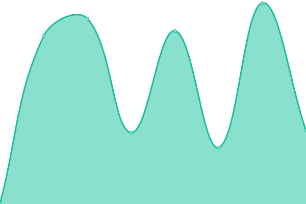 0ms
     
 | 

<a href="https://status.innovasystems.com.co/history/jemavi">100.00%</a>
    

|  [VILLAVENECIA](https://villavenecia.tonoip.com) | 🟩 Up | [villavenecia.yml](https://github.com/jveyes/upptime/commits/HEAD/history/villavenecia.yml) | 

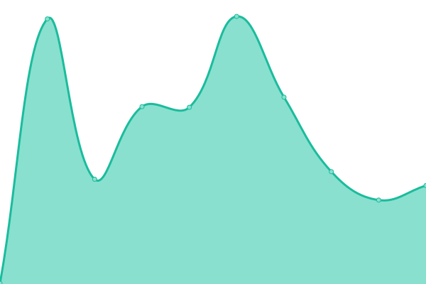 1457ms
     
 | 

<a href="https://status.innovasystems.com.co/history/villavenecia">100.00%</a>
    

|  [SALUD SOCIAL](https://saludsocial.tonoip.com) | 🟩 Up | [salud-social.yml](https://github.com/jveyes/upptime/commits/HEAD/history/salud-social.yml) | 

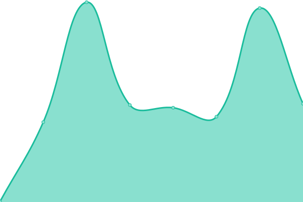 277ms
     
 | 

<a href="https://status.innovasystems.com.co/history/salud-social">100.00%</a>
    

|  [SALVADOR GAVIOTA](https://salvadorgaviota.tonoip.com) | 🟩 Up | [salvador-gaviota.yml](https://github.com/jveyes/upptime/commits/HEAD/history/salvador-gaviota.yml) | 

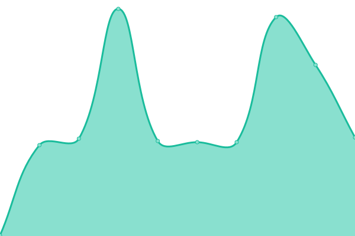 277ms
     
 | 

<a href="https://status.innovasystems.com.co/history/salvador-gaviota">100.00%</a>
    

|  [VPN INNOVA](https://vpn.innovasystems.com.co:943/admin) | 🟥 Down | [vpn-innova.yml](https://github.com/jveyes/upptime/commits/HEAD/history/vpn-innova.yml) | 

 0ms
     
 | 

<a href="https://status.innovasystems.com.co/history/vpn-innova">100.00%</a>
    

|  [GOIP](http://goip.innovasystems.com.co) | 🟥 Down | [goip.yml](https://github.com/jveyes/upptime/commits/HEAD/history/goip.yml) | 

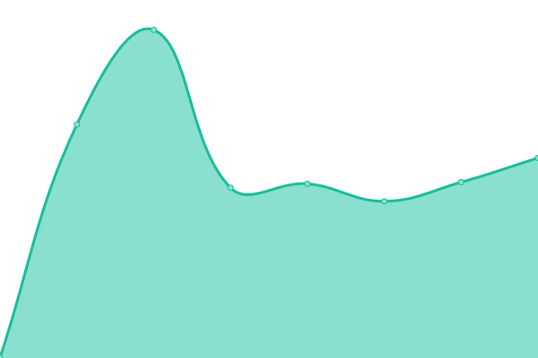 571ms
     
 | 

<a href="https://status.innovasystems.com.co/history/goip">100.00%</a>
    

|  [SUCCIONAR](https://succionar.co) | 🟩 Up | [succionar.yml](https://github.com/jveyes/upptime/commits/HEAD/history/succionar.yml) | 

 1405ms
     
 | 

<a href="https://status.innovasystems.com.co/history/succionar">100.00%</a>
    

|  [URBANA](https://urbanaadministradores.com) | 🟩 Up | [urbana.yml](https://github.com/jveyes/upptime/commits/HEAD/history/urbana.yml) | 

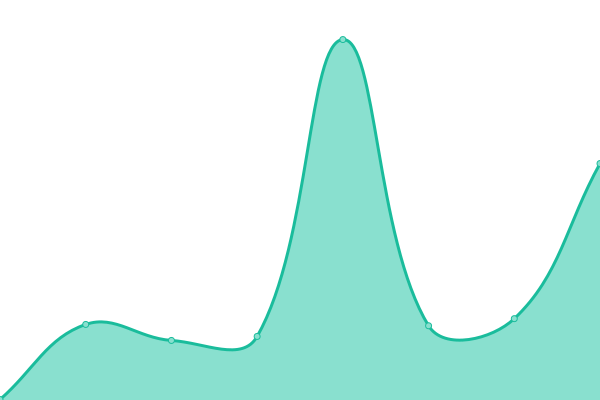 500ms
     
 | 

<a href="https://status.innovasystems.com.co/history/urbana">100.00%</a>
    

|  [TONOIP](https://tonoip.com) | 🟩 Up | [tonoip.yml](https://github.com/jveyes/upptime/commits/HEAD/history/tonoip.yml) | 

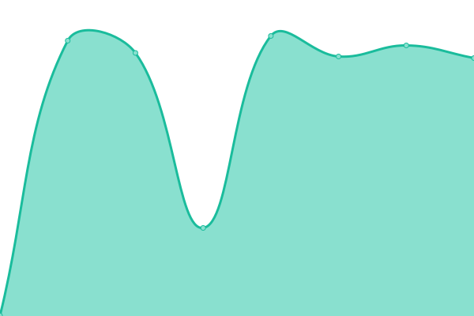 1439ms
     
 | 

<a href="https://status.innovasystems.com.co/history/tonoip">100.00%</a>
    

|  [RESERVAME](https://reservame.click) | 🟩 Up | [reservame.yml](https://github.com/jveyes/upptime/commits/HEAD/history/reservame.yml) | 

 657ms
     
 | 

<a href="https://status.innovasystems.com.co/history/reservame">100.00%</a>
    

|  [DISPAPIRUS](https://dispapirus.com) | 🟥 Down | [dispapirus.yml](https://github.com/jveyes/upptime/commits/HEAD/history/dispapirus.yml) | 

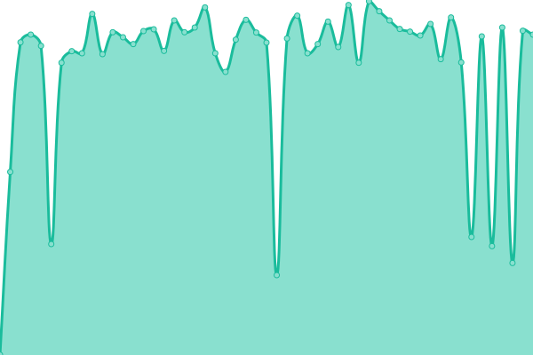 0ms
     
 | 

<a href="https://status.innovasystems.com.co/history/dispapirus">100.00%</a>
    

|  [DISPAPYRUS](https://dispapyrus.com) | 🟩 Up | [dispapyrus.yml](https://github.com/jveyes/upptime/commits/HEAD/history/dispapyrus.yml) | 

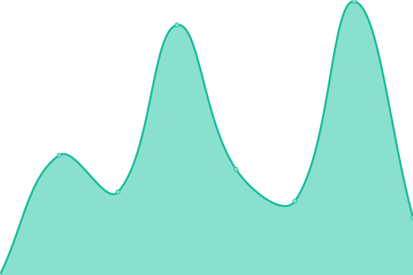 4845ms
     
 | 

<a href="https://status.innovasystems.com.co/history/dispapyrus">100.00%</a>
    

|  [GROWING CLUB](https://growingclub.co) | 🟩 Up | [growing-club.yml](https://github.com/jveyes/upptime/commits/HEAD/history/growing-club.yml) | 

 9034ms
     
 | 

<a href="https://status.innovasystems.com.co/history/growing-club">100.00%</a>
    

|  [AEREO CHARTER](https://aerochartercolombia.com) | 🟩 Up | [aereo-charter.yml](https://github.com/jveyes/upptime/commits/HEAD/history/aereo-charter.yml) | 

 2025ms
     
 | 

<a href="https://status.innovasystems.com.co/history/aereo-charter">100.00%</a>
    

|  [AQUIUB BEAUTY](https://aquiubbeauty.com) | 🟩 Up | [aquiub-beauty.yml](https://github.com/jveyes/upptime/commits/HEAD/history/aquiub-beauty.yml) | 

 1666ms
     
 | 

<a href="https://status.innovasystems.com.co/history/aquiub-beauty">100.00%</a>
    

|  [ANTALIA](https://antaliatienda.com) | 🟩 Up | [antalia.yml](https://github.com/jveyes/upptime/commits/HEAD/history/antalia.yml) | 

 2719ms
     
 | 

<a href="https://status.innovasystems.com.co/history/antalia">100.00%</a>
    

|  [ADVANCE PACKS](https://advansepacks.com) | 🟩 Up | [advance-packs.yml](https://github.com/jveyes/upptime/commits/HEAD/history/advance-packs.yml) | 

 1731ms
     
 | 

<a href="https://status.innovasystems.com.co/history/advance-packs">100.00%</a>
    

|  [GAFASPORT](https://gafasport.co) | 🟩 Up | [gafasport.yml](https://github.com/jveyes/upptime/commits/HEAD/history/gafasport.yml) | 

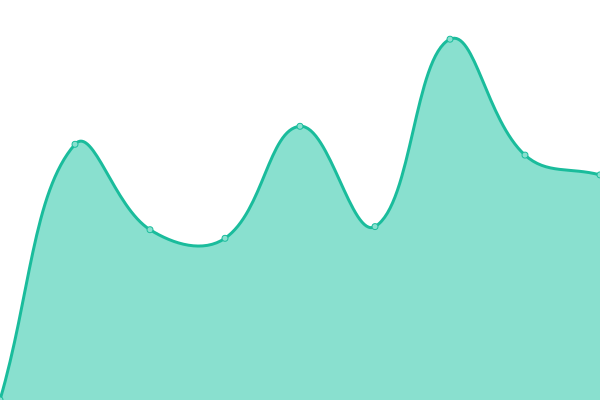 1533ms
     
 | 

<a href="https://status.innovasystems.com.co/history/gafasport">100.00%</a>
    

|  [TRAPANNI PIZZA](https://trapanipizzaestofada.com) | 🟩 Up | [trapanni-pizza.yml](https://github.com/jveyes/upptime/commits/HEAD/history/trapanni-pizza.yml) | 

 579ms
     
 | 

<a href="https://status.innovasystems.com.co/history/trapanni-pizza">100.00%</a>
    

|  [BIVPUL](https://bivpul.com) | 🟩 Up | [bivpul.yml](https://github.com/jveyes/upptime/commits/HEAD/history/bivpul.yml) | 

 321ms
     
 | 

<a href="https://status.innovasystems.com.co/history/bivpul">100.00%</a>
    

|  [DIANA PULGARIN](https://dianapulgarin.com) | 🟩 Up | [diana-pulgarin.yml](https://github.com/jveyes/upptime/commits/HEAD/history/diana-pulgarin.yml) | 

 1085ms
     
 | 

<a href="https://status.innovasystems.com.co/history/diana-pulgarin">100.00%</a>
    

|  [MATIAS LAWYER](https://matiaslawyer.com) | 🟩 Up | [matias-lawyer.yml](https://github.com/jveyes/upptime/commits/HEAD/history/matias-lawyer.yml) | 

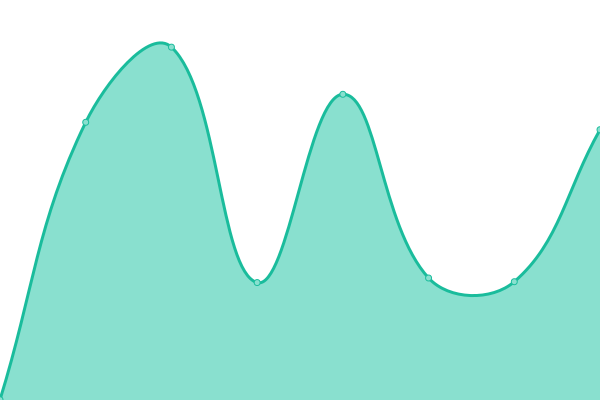 14433ms
     
 | 

<a href="https://status.innovasystems.com.co/history/matias-lawyer">95.93%</a>
    

|  [AWOOKING RECORDS](https://awookingrecords.com) | 🟥 Down | [awooking-records.yml](https://github.com/jveyes/upptime/commits/HEAD/history/awooking-records.yml) | 

 0ms
     
 | 

<a href="https://status.innovasystems.com.co/history/awooking-records">100.00%</a>
    

|  [DIMELO KING](https://dimeloking.com) | 🟩 Up | [dimelo-king.yml](https://github.com/jveyes/upptime/commits/HEAD/history/dimelo-king.yml) | 

 2266ms
     
 | 

<a href="https://status.innovasystems.com.co/history/dimelo-king">100.00%</a>
    

|  [HIT MUSIC](https://hitsmusic.com.co) | 🟩 Up | [hit-music.yml](https://github.com/jveyes/upptime/commits/HEAD/history/hit-music.yml) | 

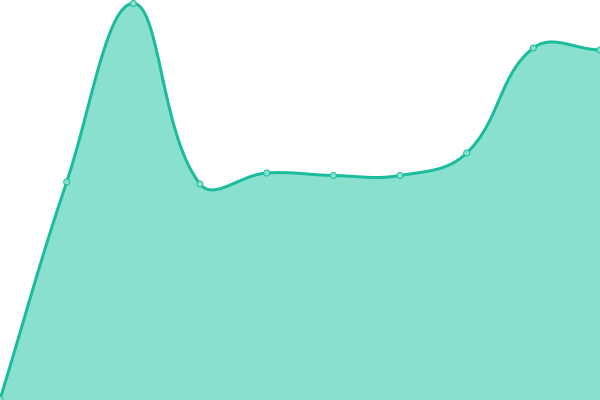 504ms
     
 | 

<a href="https://status.innovasystems.com.co/history/hit-music">100.00%</a>
    

|  [LA FOCACHERIA](https://lafocacheria.com) | 🟩 Up | [la-focacheria.yml](https://github.com/jveyes/upptime/commits/HEAD/history/la-focacheria.yml) | 

 951ms
     
 | 

<a href="https://status.innovasystems.com.co/history/la-focacheria">100.00%</a>
    

|  [NATYASH](https://natyash.com) | 🟩 Up | [natyash.yml](https://github.com/jveyes/upptime/commits/HEAD/history/natyash.yml) | 

 7033ms
     
 | 

<a href="https://status.innovasystems.com.co/history/natyash">99.11%</a>
    

|  [PERFUMERIA GOLDSTONE](https://perfumeriagoldstone.com) | 🟥 Down | [perfumeria-goldstone.yml](https://github.com/jveyes/upptime/commits/HEAD/history/perfumeria-goldstone.yml) | 

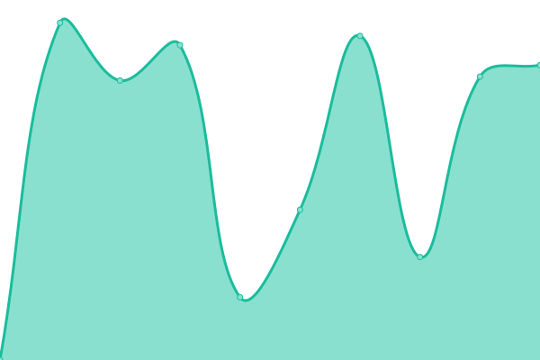 467ms
     
 | 

<a href="https://status.innovasystems.com.co/history/perfumeria-goldstone">0.00%</a>
    

|  [REPUESTOS AFS](https://repuestosafs.com) | 🟩 Up | [repuestos-afs.yml](https://github.com/jveyes/upptime/commits/HEAD/history/repuestos-afs.yml) | 

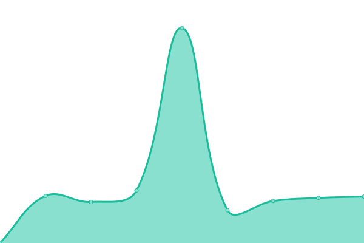 2460ms
     
 | 

<a href="https://status.innovasystems.com.co/history/repuestos-afs">43.26%</a>
    

|  [SAISAC SAS](https://saisacsas.com) | 🟩 Up | [saisac-sas.yml](https://github.com/jveyes/upptime/commits/HEAD/history/saisac-sas.yml) | 

 3735ms
     
 | 

<a href="https://status.innovasystems.com.co/history/saisac-sas">100.00%</a>
    

|  [SAISAC SHOP](https://saisacshop.com) | 🟩 Up | [saisac-shop.yml](https://github.com/jveyes/upptime/commits/HEAD/history/saisac-shop.yml) | 

 2301ms
     
 | 

<a href="https://status.innovasystems.com.co/history/saisac-shop">100.00%</a>
    

|  [SHEKINA EXTENSIONS](https://shekinaextensions.com) | 🟩 Up | [shekina-extensions.yml](https://github.com/jveyes/upptime/commits/HEAD/history/shekina-extensions.yml) | 

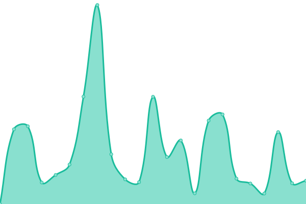 11562ms
     
 | 

<a href="https://status.innovasystems.com.co/history/shekina-extensions">98.24%</a>
    

|  [SOTTO](https://sotto.com.co) | 🟥 Down | [sotto.yml](https://github.com/jveyes/upptime/commits/HEAD/history/sotto.yml) | 

 0ms
     
 | 

<a href="https://status.innovasystems.com.co/history/sotto">100.00%</a>
    

|  [YERBABUENA](https://yerbabuenacolombia.com) | 🟥 Down | [yerbabuena.yml](https://github.com/jveyes/upptime/commits/HEAD/history/yerbabuena.yml) | 

 481ms
     
 | 

<a href="https://status.innovasystems.com.co/history/yerbabuena">55.26%</a>
    

<!--end: status pages-->

## 📄 License

- Powered by: [Upptime](https://github.com/upptime/upptime)
- Code: [MIT](./LICENSE) © [Jesus Maria Villalobos](https://jemavi.co)
- Data in the `./history` directory: [Open Database License](https://opendatacommons.org/licenses/odbl/1-0/)
